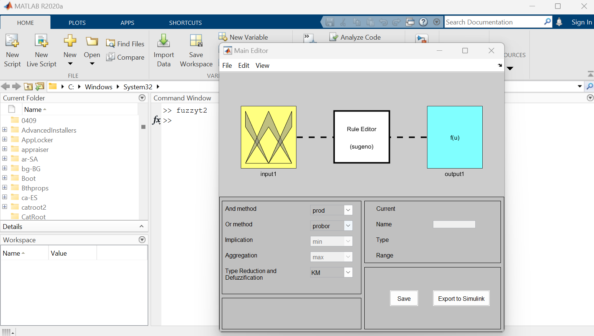
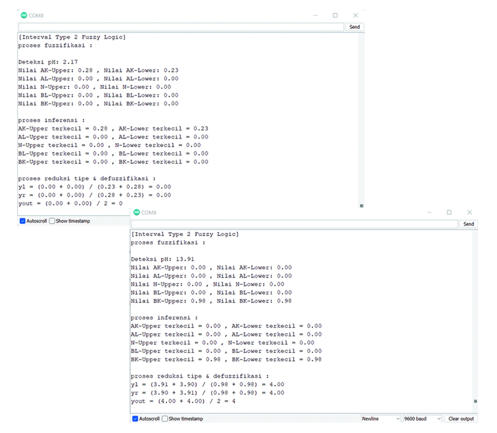

[](https://github.com/ellerbrock/open-source-badges/)
[](https://opensource.org/licenses/MIT)


# Aquaponic-pH-Control-Monitoring-with-Type-2-Fuzzy-Method-Based-on-IoT-Bot
<strong>Undergraduate Thesis Project Documentation (S1) - Informatics UPN Veteran Jatim</strong><br><br>
Aquaponic system is a combined farming system between fish with vegetables where the activities are mutually beneficial. On the other hand, crop failure can also be a concern for aquaponic farmers as this can happen at any time. Harvest failure can be influenced by many factors, but is usually caused by the high pH ambiguity of the water around the scope of cultivation. The aquaponic farmers are worried that if the crop failure continues it will have a negative impact on their food security. This project was created in the hope of solving the pH problem. This project has been carried out and took approximately 1 year. The system created can control and monitor changes in water pH at any time. This system is based on the Internet of Things (IoT), using MQTT as the communication protocol. This system is also equipped with artificial intelligence, which uses IT2FL (Interval Type-2 Fuzzy Logic) as its decision support. In addition, the system interface uses Telegram Bot, making it easier for users to interact.

<br><br>

## Project Requirements
| Part | Description |
| --- | --- |
| Development Board | DOIT ESP32 DEVKIT V1 |
| Supporting Board | Arduino Uno R3 |
| Code Editor | Arduino IDE |
| Application Support | • Telegram Bot<br>• Matlab R2020 |
| Driver | CP210X USB Driver |
| IoT Platform | io-t.net |
| Communications Protocol | • Inter Integrated Circuit (I2C)<br>• Message Queuing Telemetry Transport (MQTT)<br>• MTProto |
| IoT Architecture | 4 Layer |
| Matlab |  Fuzzy Interface System |
| Programming Language | C/C++ |
| Arduino Library | • WiFi (default)<br>• Wire (default)<br>• PubSubClient<br>• LiquidCrystal_I2C<br>• CTBot<br>• ArduinoJson<br>• RTClib |
| Actuators | • Submersible pump aquarium (x1)<br>• Pneumatic solenoid valve (x2)<br>• Piezoelectric (x1) |
| Sensor | • pH Sensor (x1)<br>• RTC (x1) |
| Display | LCD I2C (x1) |
| Experimental Object | • Pakcoy mustard seeds<br>• Dumbo catfish fry |
| Other Components | • Micro USB cable - USB type A (x1)<br>• Jumper cable (1 set)<br>• Switching power supply 12V 1A (x1)<br>• Electrical relay 2 channel (x1)<br>• Round switch (x1)<br>• ESP32 expansion board (x1)<br>• PCB Dot Matrix (x1)<br>• Terminal PCB block screw (x10)<br>• Socket female jack DC (x1)<br>• Connector male jack DC (x3)<br>• Probe Elektroda pH (x1)<br>• Pipes (1 set)<br>• Netpot (1 set)<br>• Rockwool (1 set)<br>• Flannel fabric (1 set)<br>• Water filter (x1)<br>• Glass hubcap (1 set)<br>• Bottle (x2)<br>• Aquarium wheeled placemat (x1)<br>• Aquarium (x1)<br>• Casing box (x1)<br>• Skun (1 set)<br>• Galvanized plate (x1)<br>• Bolts plus (1 set)<br>• Nuts (1 set) |

<br><br>

## Download & Install 
1. Arduino IDE

   <table><tr><td width="810">

   ```
   https://www.arduino.cc/en/software
   ```

   </td></tr></table><br>

2. CP210X USB Driver

   <table><tr><td width="810">

   ```
   https://bit.ly/CP210X_USB_Driver
   ```

   </td></tr></table><br>

3. Matlab R2020

   <table><tr><td width="810">

   ```
   https://bit.ly/Matlab_R2020a_Installer
   ```

   </td></tr></table>

<br><br>

## Project Designs
<table>
<tr>
<th width="280">Pictorial Diagram</th>
<th width="280">Prototype Design</th>
<th width="280">Main Box Design</th>
</tr>
<tr>
<td></td>
<td></td>
<td></td>
</tr>
</table>
<table>
<tr>
<th width="280">Fuzzy Interface System IT2FL</th>
<th width="280">IT2FL Input Variable</th>
<th width="280">IT2FL Output Variable</th>
</tr>
<tr>
<td></td>
<td></td>
<td></td>
</tr>
</table>

<br><br>

## Scanning the I2C Address on the LCD
<table><tr><td width="840">
   
```ino
#include <Wire.h>

void setup() {
  Wire.begin();
  Serial.begin(115200);
  while (!Serial); // Wait for serial monitor
  Serial.println("\nI2C Scanner");
}

void loop() {
  int nDevices = 0;
  Serial.println("Scanning...");

  for (byte address = 1; address < 127; ++address) {
    // The i2c_scanner uses the return value of the Wire.endTransmission
    // To see if a device did acknowledge to the address
    Wire.beginTransmission(address);
    byte error = Wire.endTransmission();

    if (error == 0) {
      Serial.print("I2C device found at address 0x");
      if (address < 16) {
        Serial.print("0");
      }
      Serial.print(address, HEX);
      Serial.println("  !");

      ++nDevices;
    } else if (error == 4) {
      Serial.print("Unknown error at address 0x");
      if (address < 16) {
        Serial.print("0");
      }
      Serial.println(address, HEX);
    }
  }
  if (nDevices == 0) {
    Serial.println("No I2C devices found\n");
  } else {
    Serial.println("done\n");
  }
  delay(5000); // Wait 5 seconds for next scan
}
```

</td></tr></table><br><br>

##  pH Sensor Calibration
The pH sensor can be calibrated using the results of a linear regression calculation. You can see the linear regression equation as follows.

<table>
   <tr>
   <td width="40">I</td>
   <td width="800">

   $$\left(
   Y = a+b.X
   \right)$$
         
   </td>      
   </tr>
</table><br>

Explanation of the symbols in equation I, you can see more details in the following table.

<table>
   <tr height="50px">
      <th width="120">Symbol</th>
      <th width="720">Description</th>
   </tr>
   <tr>
      <td>𝑌</td>
      <td>pH buffer value</td>
   </tr>
   <tr>
      <td>𝑋</td>
      <td>voltage value obtained based on Y</td>
   </tr>
   <tr>
      <td>𝑎 and 𝑏</td>
      <td>linear regression determination value</td>
   </tr>
</table><br>

The linear regression determination values (a and b) can be obtained through equations II and III.

<table>
   <tr>
   <td width="40">II</td>
   <td width="800">
   
   $$\left(
    a = \frac{\sum Y.\sum X^{2}-\sum X.\sum XY}{n.\sum X^{2}-(\sum X)^{2}}
   \right)$$

   </td>
   </tr>
   <tr>
   <td width="40">III</td>
   <td width="800">
   
   $$\left(
    b = \frac{n.\sum XY-\sum X.\sum Y}{n.\sum X^{2}-(\sum X)^{2}}
   \right)$$

   </td>
   </tr>
</table><br>

Example of pH sensor calibration: <a href="https://github.com/devancakra/Aquaponic-pH-Control-Monitoring-with-Type-2-Fuzzy-Method-Based-on-IoT-Bot/blob/master/Assets/Articles/pHSensor-Calibration-Example.md">Click Here</a>

<br><br>

## RTC Sensor Calibration
This RTC sensor can be calibrated using the following program code :
   
<table><tr><td width="840">

```ino
#include <RTClib.h> // Calling the RTC library
RTC_DS3231 rtc; // Constructor

void setup(){
   RTCinit(); // Calling the RTCinit method
}

void loop(){}

void RTCinit(){
   // Starting up the RTC
   rtc.begin();

   // DateTime Setting
   rtc.adjust(DateTime(F(__DATE__), F(__TIME__)));

   // Set Time Now
   // If calibrated, please close with a comment
   rtc.adjust(DateTime(YYYY,MM,DD,HH,MM,SS));
}
```

</td></tr></table><br><br>

## Arduino IDE Setup
1. Open the ``` Arduino IDE ``` first, then open the project by clicking ``` File ``` -> ``` Open ``` : 

   <table><tr><td width="810">
   
      ``` PH_IT2FL.ino ```

   </td></tr></table><br>
   
2. Fill in the ``` Additional Board Manager URLs ``` in Arduino IDE

   <table><tr><td width="810">
      
      Click ``` File ``` -> ``` Preferences ``` -> enter the ``` Boards Manager Url ``` by copying the following link :
      
      ```
      https://dl.espressif.com/dl/package_esp32_index.json
      ```

   </td></tr></table><br>
   
3. ``` Board Setup ``` in Arduino IDE

   <table>
      <tr><th width="810">

      How to setup the ``` DOIT ESP32 DEVKIT V1 ``` board
            
      </th></tr>
      <tr><td>
      
      • Click ``` Tools ``` -> ``` Board ``` -> ``` Boards Manager ``` -> Install ``` esp32 ```. 
      
      • Then selecting a Board by clicking: ``` Tools ``` -> ``` Board ``` -> ``` ESP32 Arduino ``` -> ``` DOIT ESP32 DEVKIT V1 ```.

      • ``` Arduino Uno ``` board in this project is only used as a filter or voltage divider.

      • You don't need to configure the ``` Arduino Uno ``` board, just focus on the ``` ESP32 ```.

   </td></tr></table><br>
   
4. ``` Change the Board Speed ``` in Arduino IDE

   <table><tr><td width="810">
      
      Click ``` Tools ``` -> ``` Upload Speed ``` -> ``` 115200 ```

   </td></tr></table><br>
   
5. ``` Install Library ``` in Arduino IDE

   <table><tr><td width="810">
      
      Download all the library zip files. Then paste it in the: ``` C:\Users\Computer_Username\Documents\Arduino\libraries ```

   </td></tr></table><br>

6. ``` Port Setup ``` in Arduino IDE

   <table><tr><td width="810">
      
      Click ``` Port ``` -> Choose according to your device port ``` (you can see in device manager) ```

   </td></tr></table><br>

7. Change the ``` WiFi Name ```, ``` WiFi Password ```, and so on according to what you are currently using.<br><br>

8. Before uploading the program please click: ``` Verify ```.<br><br>

9. If there is no error in the program code, then please click: ``` Upload ```.<br><br>
    
10. Some things you need to do when using the ``` ESP32 board ``` :

    <table><tr><td width="810">
       
      • ``` Arduino IDE ``` information: ``` Uploading... ``` -> immediately press and hold the ``` BOOT ``` button.

      • ``` Arduino IDE ``` information: ``` Writing at .... (%) ``` -> release the ``` BOOT ``` button.

      • Wait until the message appears: ``` Done Uploading ``` -> ``` The program is directly operated ```.

      • Press the ``` EN (RST) ``` button and then ``` Restart ``` to handle the ``` ESP32 ``` board that cannot process the ``` SC ```.

      • Do not press the ``` BOOT ``` and ``` EN ``` buttons at the same time as this may switch to ``` Upload Firmware ``` mode.

    </td></tr></table><br>

11. If there is still a problem when uploading the program, then try checking the ``` driver ``` / ``` port ``` / ``` others ``` section.

<br><br>

## Io-t.net Setup
1. Getting started with io-t.net :

   <table><tr><td width="810">
      
      • Go to the official website at the following link : <a href="https://io-t.net/">io-t.net</a>.
      
      • If you do not have an account, please <a href="https://i-ot.net/register">Register</a> first -> activate your account via email.
      
      • If you already have an account, please <a href="https://i-ot.net/login">Sign In</a> to be able to access io-t.net services.

   </td></tr></table><br>

2. Create a node :

   <table><tr><td width="810">
      
      • Go to ``` Instance ``` menu -> ``` Set Node ```.
      
      • Then give the node a unique name that you use.

   </td></tr></table><br>

3. Create a device :

   <table><tr><td width="810">
      
      • Go to ``` Devices ``` menu.
      
      • Select ``` Add Devices ``` -> fill in the ``` Client ID ```, ``` Access ```, ``` Topic ``` sections as needed. For example :
   
      - ``` Client ID ``` -> ``` Phiotnet_v1 ```.

      - ``` Access ``` -> ``` Publish & Subscribe ```.

      - ``` Topic ``` -> ``` detect ```.

   </td></tr></table>
   
<br><br>

## Telegram Bot Setup
1. Open <a href="https://t.me/botfather">@BotFather</a>.<br><br>

2. Type ``` /newbot ```.<br><br>

3. Type the desired bot name, for example: ``` phiotnet_bot ```.<br><br>

4. Type the desired bot username, for example: ``` phiotnet_bot ```.<br><br>

5. Also do it for bot image settings, bot descriptions, and so on according to your needs.<br><br>

6. Copy ``` your telegram bot API token ``` -> then paste it into the ``` #define BOTtoken "YOUR_API_BOT_TOKEN" ``` section. 

   <table><tr><td width="810">
   For example :<br><br>

   ```ino
   #define BOTtoken "2006772150:AAE6Fdjk3KbiySkzV6CLbd6ClJDzgTfJ5y0"
   ```
   
   </td></tr></table>

<br><br>

## Matlab Setup
1. Open the ``` Matlab ```.<br><br>

2. Open the ``` Set Path ``` dialog box using the command :
   
   <table><tr><td width="810">
      
   ```
   pathtool
   ```

   </td></tr></table>
   
   <br><br>

3. Select ``` Add Folder... ``` -> search the ``` FIS-IT2FLS-Toolbox-MATLAB ``` folder -> ``` Select Folder ```.<br><br>

4. Click ``` Save ``` and then click ``` Close ```.<br><br>

5. Open the ``` IT2FL Toolbox ``` using the command :
   
   <table><tr><td width="810">

   ```
   fuzzyt2
   ```

   </td></tr></table>
   
   <br><br>

6. The rest you can customize according to your needs.

<br><br>

## Get Started
1. Download and extract this repository.<br><br>
   
2. Make sure you have the necessary electronic components.<br><br>
   
3. Make sure your components are designed according to the diagram.<br><br>
   
4. Configure your device according to the settings above.<br><br>

5. Please enjoy [Done].

<br><br>

## Demonstration of Application
Via Telegram: <a href="https://t.me/phiotnet_bot">@phiotnet_bot</a>

<br><br>

## Highlights
<table>
<tr>
<th width="280">Product</th>
<th width="280">IT2FL Decision Support System</th>
<th width="280">Telegram Bot</th>
</tr>
<tr>
<td></td>
<td></td>
<td></td>
</tr>
</table>

<br>
<strong>More information:</strong> <br><br>
<table><tr><td width="840">
   • Undergraduate Thesis: <a href="http://repository.upnjatim.ac.id/id/eprint/7014"><u>Click Here</u></a><br><br>
   • SINTA-type journals: <a href="https://publikasi.mercubuana.ac.id/index.php/Incomtech/article/view/15453"><u>Click Here</u></a><br><br>
   • Non SINTA-type journals: <a href="https://www.researchgate.net/publication/363660330_SISTEM_KONTROL_PH_UP-DOWN_BERBASIS_NODEMCU32_DENGAN_METODE_ON-OFF_CONTROLLER"><u>Click Here</u></a>
</td></tr></table>

<br><br>

## Disadvantages
1. Hardware:

   <table><tr><td width="810">
   
   • Electrical leakage current is caused by the use of non-standard PSU or the lack of insulators used.
   
   • Lack of air circulation in the main box can cause heat.
   
   • NO (Normally Open) applied to the relay causes the solenoid valve to become hot.
   
   • The lack of electric current causes the LCD to not power on.
   
   • The use of Arduino Uno as a filter or voltage divider is considered inefficient.
   
   • The pH sensor probe has no protection.
   
   </td></tr></table><br>

2. Firmware:

   <table><tr><td width="810">
   
   • The delay time in each method is considered excessive, it should use the ``` millis() ``` function so as not to interfere with other methods.

   • The use of ``` io-t.net ``` is considered not maximal because it is known that its use is just limited to ``` publish ```.

   • The security features on telegram bots are not good.

   </td></tr></table><br>

3. Others:

   <table><tr><td width="810">
   
   • Filling gallons of pH and giving AB Mix is still done manually, making it difficult for users.
   
   • Fish feeding is still done manually.
   
   • Pakcoy mustard greens lack regular sunlight intake, so after transplanting the land, its development is not as fast as before.

   • Draining and filling the aquarium water is still done manually, making it very inconvenient for users.

   </td></tr></table>

<br><br>

## Advantages
<table><tr><td width="840">
   
   • The system interface is through a telegram bot, so that giving orders as well as monitoring efforts can be done anytime and anywhere.
   
   • With IT2FL, the accuracy of the sensor becomes more accurate.

   • The system can automatically make its own decisions and can also be manually controlled by the user.
   
   • The system has been equipped with a timing feature.

</td></tr></table><br><br>

## In the Future
<table><tr><td width="840">
   
   • Need for increased amperage. You can use a 3A PSU.

   • Need to change the NO (Normally Open) to NC (Normally Close) on the relays so that the electrified device can avoid damage.

   • Need for voltage and current sharing. You can use a step down.
   
   • Need for increased the security features of telegram bots.

   • Need for increased security on the pH sensor.
   
   • Need for the addition of pH tank re-fill devices and AB mix tanks that are made automatically.
   
   • Need for additional devices that can measure water temperature and ammonia.
   
   • Need for additional devices in automatic fish feeding.
   
   • Need for additional devices that can emit warm light as a substitute for sunlight.
   
   • Need for additional devices that can drain and fill aquarium water.
   
   • Need for additional devices that can optimally cool the main box. 
   
   • The existing hydroponic planting field in this study may need to be developed further in the future. In addition, rockwool planting media can be replaced with other planting media that are more adequate for plant needs, for example: husk charcoal or cocopeat.

</td></tr></table><br><br>

## Appreciation
If this work is useful to you, then support this work as a form of appreciation to the author by clicking the ``` ⭐Star ``` button at the top of the repository.

<br><br>

## Disclaimer
This application has been created by including third-party sources. Third parties here are service providers, whose services are in the form of libraries, frameworks, and others. I thank you very much for the service. It has proven to be very helpful and implementable.

<br><br>

## LICENSE
MIT License - Copyright © 2020 - Devan C. M. Wijaya, S.Kom

Permission is hereby granted without charge to any person obtaining a copy of this software and the software-related documentation files to deal in them without restriction, including without limitation the right to use, copy, modify, merge, publish, distribute, sublicense, and/or sell copies of the Software, and to permit persons receiving the Software to be furnished therewith on the following terms:

The above copyright notice and this permission notice must accompany all copies or substantial portions of the Software.

IN ANY EVENT, THE AUTHOR OR COPYRIGHT HOLDER HEREIN RETAINS FULL OWNERSHIP RIGHTS. THE SOFTWARE IS PROVIDED AS IS, WITHOUT WARRANTY OF ANY KIND, EITHER EXPRESS OR IMPLIED, THEREFORE IF ANY DAMAGE, LOSS, OR OTHERWISE ARISES FROM THE USE OR OTHER DEALINGS IN THE SOFTWARE, THE AUTHOR OR COPYRIGHT HOLDER SHALL NOT BE LIABLE, AS THE USE OF THE SOFTWARE IS NOT COMPELLED AT ALL, SO THE RISK IS YOUR OWN.
